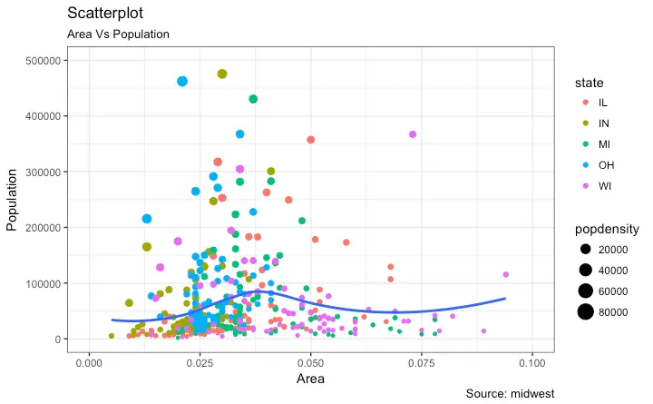
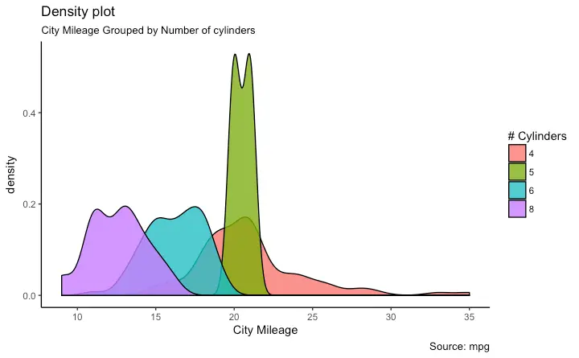
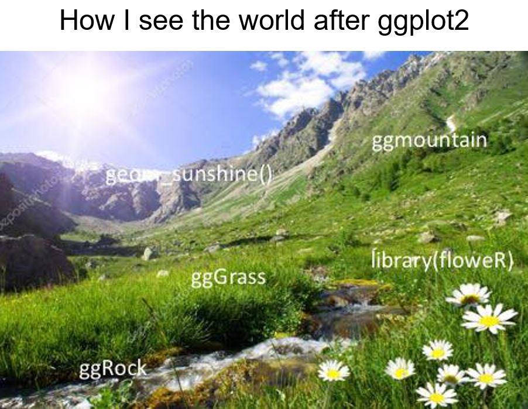

```{r setup, include=FALSE}
knitr::opts_chunk$set(echo = TRUE)
```


# Beginning remarks

## outline
For today's workshop session, we'll try the following tasks
- customize the figures with legends and themes
- practice 2 complicated examples
- try some useful packages


# load library and data
```{r}
library(tidyverse)

data(mpg)
head(mpg)
```

# customize the figure
```{r}
base = ggplot(data = mpg)

plot1 = base + 
  geom_point(aes(x = displ, y = hwy, color = drv))
```

## plot title, subtitle, caption and tag
```{r}
plot1 + labs(title = "mytitle", 
            subtitle = "my subtitle", 
            caption = "this is a caption",
            tag = "a)")
```


## axis title
**Exercise**: change the x and y axis title using the `scale_*` function and the `lab` function

**Exercise**: check the following 2 plots, what do you find?
```{r}
plot1 + labs(x="", y="")
plot1 + labs(x=NULL, y=NULL)
```


## legend
### legend title and label
change legend title and label
```{r}
plot1 + 
  scale_color_discrete(name = "Type", labels = c("4 wheel", "front drive", "rear drive"))
```


**Exercise**:  change the dot color to `red`, `blue`, `green`, rename the x and y axis label to be `displacement` and `highway`, add title and subtitle to the plots


### compound legend
```{r}
base + geom_point(aes(x = displ, y = hwy, color = drv, shape = drv))
```

### hide legend
```{r}
base + 
  geom_point(aes(x = displ, y = hwy, color = drv), show.legend = FALSE)
```


### legend key layout
```{r}
plot1 + guides(color = guide_legend(ncol = 2))
plot1 + guides(color = guide_legend(ncol = 2, byrow = TRUE))
plot1 + guides(color = guide_legend(ncol = 2, byrow = FALSE, reverse=TRUE))
```

### legend override
```{r}
base + geom_point(aes(x = displ, y = hwy, color = drv), alpha = 0.2)
base + geom_point(aes(x = displ, y = hwy, color = drv), alpha = 0.2) +
  guides(colour = guide_legend(override.aes = list(alpha = 1)))
```


## theme
### check built in themes
```{r}
plot1
plot1 + theme_bw()
plot1 + theme_classic()
plot1 + theme_dark()
plot1 + theme_grey()
plot1 + theme_light()
plot1 + theme_linedraw()
plot1 + theme_minimal()
plot1 + theme_test()
plot1 + theme_void()
```

### theme elements
#### text
```{r}
plot1
plot1 + theme(axis.title = element_text(face = "bold", family = "consolas", size = 15))
```

#### line
```{r}
plot1 
plot1 + theme(panel.grid = element_line(colour = "grey"))
plot1 + theme(panel.grid.major = element_blank(), panel.grid.minor = element_blank())
```

#### rect
```{r}
plot1
plot1 + theme(plot.background = element_rect(fill = "linen"),
              panel.background = element_rect(fill = "grey"))
```


**Exercise**:
- increase the size of the legend key and labels

- save the figure to a file called `plot.pdf`


# practical examples
## scatter plot
try to reproduce the `example_scatter_plot.png` figure using dataset `midwest`

```{r, echo=FALSE, fig.cap="A caption", out.width = '100%'}

```

```{r}

```


## density plot
try to reproduce the `example_density.png` figure using dataset `mpg`
```{r, echo=FALSE, fig.cap="A caption", out.width = '100%'}

```

```{r}

```


# useful packages
## esquisse
[esquisse](https://cran.r-project.org/web/packages/esquisse/vignettes/get-started.html)
```{r}
library(esquisse)

# demo
```


## ggpubr
[ggpubr](https://rpkgs.datanovia.com/ggpubr/)
```{r}
library(ggpubr)
my_comparisons <- list( c("f", "r"), c("r", "4"), c("f", "4") )

ggviolin(mpg, x = "drv", y = "hwy", fill = "drv",
         palette = c("#00AFBB", "#E7B800", "#FC4E07"),
         add = "boxplot", add.params = list(fill = "white"))+
  stat_compare_means(comparisons = my_comparisons, label = "p.signif")+ # Add significance levels
  stat_compare_means(label.y = 50)
```


## ggExtra
[ggExtra](https://cran.r-project.org/web/packages/ggExtra/vignettes/ggExtra.html)
```{r}
library(ggExtra)

g <- ggplot(mpg, aes(cty, hwy)) + 
  geom_point() + 
  geom_smooth(method="lm", se=F)

g
ggMarginal(g, type = "histogram", fill="transparent")
ggMarginal(g, type = "boxplot", fill="transparent")
ggMarginal(g, type = "density", fill="transparent")
```

## patchwork
[patchwork](https://patchwork.data-imaginist.com/)

```{r}
library(patchwork)

p1 = ggplot(mpg, aes(displ, cty)) + 
  geom_point() + 
  geom_smooth(method="lm", se=F)

p2 = ggplot(mpg, aes(displ, hwy)) + 
  geom_point() + 
  geom_smooth(method="lm", se=F)

p3 = ggplot(mpg, aes(cty, hwy)) + 
  geom_point() + 
  geom_smooth(method="lm", se=F)


# patch together
p1+p2

# patch 
(p1 | p2)/p3
```

## other useful functions
- ggcorrplot: https://cran.r-project.org/web/packages/ggcorrplot/readme/README.html
- ggridge: https://cran.r-project.org/web/packages/ggridges/vignettes/introduction.html
- ggbreak: https://cran.r-project.org/web/packages/ggbreak/vignettes/ggbreak.html
- ggsci: https://nanx.me/ggsci/


see a full list of extensions: https://exts.ggplot2.tidyverse.org/gallery/

```{r, echo=FALSE, fig.cap="A caption", out.width = '100%'}

```


